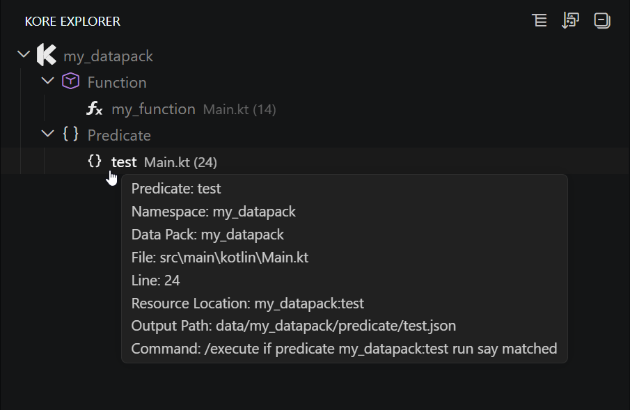
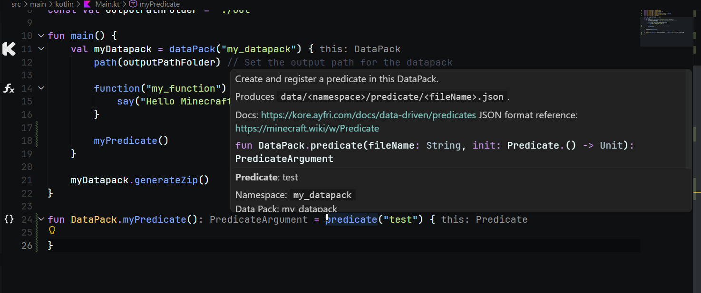

# Kore Assistant

A Visual Studio Code extension providing powerful tools for working with [Kore](https://github.com/Ayfri/Kore), a Kotlin library for creating Minecraft datapacks without writing JSON.

## Features

- **Kore declaration discovery**: Detects datapacks, functions, tags, predicates, recipes, advancements, dialogs, world-generation resources (features, carvers, density functions, structures), and the other Kore DSL builders in Kotlin files, including builders nested in a scope such as `recipes { }` or `structures { }`
- **Workspace-aware resolution**: A `dataPack(NAMESPACE)`, `function("leaf_$id")` or `lootTable(Names.PREFIX + "chest")` resolves through the `val` constants of the workspace (chains like `val NS = "${BASE}_pack"` included), and a `fun DataPack.setup()` / `fun setup(dp: DataPack)` / `context(dp: DataPack) fun setup()` helper is filed under the datapack whose `dataPack { }` block calls it (directly or through other helpers). Helpers nobody calls fall back to the datapack declared in the closest folder, so a multi-project workspace like the Kore `Examples` repo keeps each project's helpers under its own pack
- **Gutter icons and hovers**: Marks declarations in the editor and shows their resource location, generated output path, source location, and relevant Minecraft command
- **Diagnostics**: Warns when two declarations write the same file (the last one generated silently wins), reports a `function("helper")` command whose target is not declared in the project with quick fixes (rename to a close match, call it under the namespace that declares it, swap inverted `namespace, name` arguments, or create the missing function), and checks `craftingShaped` recipes for grid size, row width, missing and unused keys. Turn them off with `kore-assistant.diagnostics.enabled`
- **Kore Explorer**: Browses declarations by datapack and resource kind, or groups them by source file
- **Navigation and copy actions**: Reveals the declaration source, and every explorer node has a context menu to copy its name, namespace, resource location, output path or folder, command, file path or `file:line` declaration path
- **Sorting and grouping**: Switch between file and type views, then sort declarations by source file or name
- **Snippets**: Code snippets for quickly creating Kore elements with proper imports

### Kore Explorer

Browse each datapack and its generated resources directly from the Activity Bar. Resource folders are grouped by their Kore declaration kind, and nested resource paths stay organized in the tree.

### Declaration Details

Hover a gutter icon to inspect the declaration's generated resource location and output path without leaving the source file.

## Installation

You can install this extension through the VS Code Marketplace:

1. Open VS Code
2. Go to the Extensions view (`Ctrl+Shift+X` or `Cmd+Shift+X` on macOS)
3. Search for "Kore Assistant"
4. Click Install

Alternatively, you can install it directly from the [VS Code Marketplace](https://marketplace.visualstudio.com/items?itemName=ayfri.kore-assistant).

## About Kore

[Kore](https://github.com/Ayfri/Kore) is a modern Kotlin library that allows you to:

- Create Minecraft datapacks using Kotlin instead of JSON
- Write clean, type-safe code with full IDE support
- Generate commands, recipes, advancements and other datapack components
- Support for Minecraft 1.20 and later versions

Visit [kore.ayfri.com](https://kore.ayfri.com/) for official documentation.

## Requirements

- Visual Studio Code 1.125.0 or newer
- A Kotlin language extension, e.g. the official [Kotlin by JetBrains](https://marketplace.visualstudio.com/items?itemName=JetBrains.kotlin-server) extension (powered by [kotlin-lsp](https://github.com/Kotlin/kotlin-lsp))

## Usage

1. Open a Kotlin file containing Kore declarations, such as `dataPack`, `function`, `predicate`, `blockTag`, or `recipes { craftingShaped(...) }`
2. The extension will automatically detect and highlight them with gutter icons
3. Use the Kore Explorer in the Activity Bar to browse declarations by datapack and resource kind
4. Select a declaration to jump to its Kotlin source, or right-click any node (datapack, category, folder, file or declaration) to copy one of its values or open its source
5. Configure grouping and sorting with the view toolbar buttons
6. Use the snippets to quickly create new Kore elements (see snippets section below)

To refresh the icons manually, run the "Kore: Refresh Gutter Icons" command from the command palette.

## Snippets

The extension provides the following snippets for Kotlin files:

- `dp` - Creates a datapack declaration with automatic import
- `fn` - Creates a function declaration with automatic import

## Extension Settings

- `kore-assistant.diagnostics.enabled` (default `true`): report duplicate declarations, unresolved `function` commands and invalid `craftingShaped` patterns in the Problems view
- Group elements by file or type
- Sort elements by name or file location

## Feedback & Issues

Please file issues and feature requests on the [project's repository](https://github.com/Kore-Minecraft/Kore-Assistant-VSCode/issues).

## License

This extension is licensed under the [GNU General Public License v3.0](LICENSE).

## Contributing

Contributions to the Kore Assistant extension are welcome!

1. Fork the [repository](https://github.com/Kore-Minecraft/Kore-Assistant-VSCode)
2. Create your feature branch: `git checkout -b feature/amazing-feature`
3. Install dependencies: `bun install`
4. Make your changes
5. Build and test: `bun run package`
6. Commit your changes: `git commit -m 'Add some amazing feature'`
7. Push to the branch: `git push origin feature/amazing-feature`
8. Open a Pull Request

### Publishing

The extension is published to the VS Code Marketplace automatically when a new tag is pushed to the repository.

To publish a new version:

1. Update the version in `package.json`
2. Update the CHANGELOG.md file
3. Update the version badge in README.md
4. Commit your changes: `git commit -m 'Release v0.x.x'`
5. Tag the release: `git tag v0.x.x`
6. Push the changes: `git push && git push --tags`

GitHub Actions will automatically build and publish the extension.
